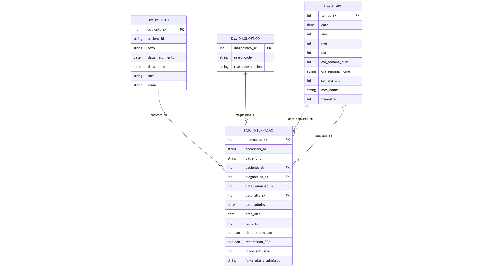

# MVP – Engenharia de Dados

Aluno: Pedro Mendes de Azambuja Rodrigues

Este repositório contém o MVP da sprint de Engenharia de Dados do curso de Ciência de dados e Analytics da PUC-Rio. O MVP foi desenvolvido na plataforma
Databricks Community Edition, com pipeline em camadas (Bronze, Silver e Gold) e
modelagem de Data Warehouse em esquema estrela, utilizando dados sintéticos do Synthea.

Os notebooks são apresentados **apenas para leitura**, com resultados e figuras já
gerados. Não é necessário executar o código.

## Ordem de leitura

1. [mvp00-objetivo.ipynb](mvp00-objetivo.ipynb)  
2. [mvp01-preparacao.ipynb](mvp01-preparacao.ipynb)  
3. [mvp02-bronze.ipynb](mvp02-bronze.ipynb)  
4. [mvp03-silver.ipynb](mvp03-silver.ipynb)  
5. [mvp04-gold.ipynb](mvp04-gold.ipynb)  
6. [mvp05-analise.ipynb](mvp05-analise.ipynb)  
7. [mvp06-autoavaliacao.ipynb](mvp06-autoavaliacao.ipynb)  

## Modelo dimensional (Esquema estrela)

